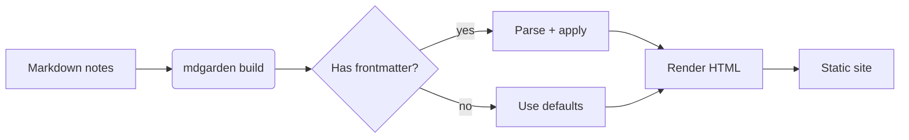
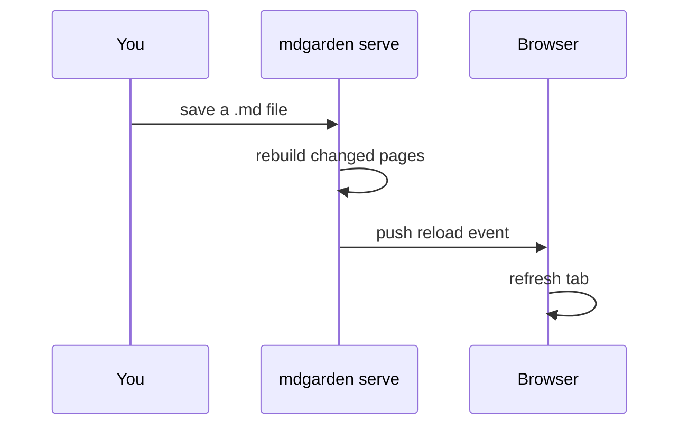

# Diagrams

mdgarden renders fenced ` ```mermaid ` blocks as interactive diagrams via a
lazy-loaded client chunk (only fetched on pages that actually use one), and
plain SVG/PNG images load like any other embed.

## Flowchart



## Sequence diagram



## A hand-drawn SVG

Not every diagram needs Mermaid — a plain SVG embeds the same way:

![[diagram.svg]]

> [!note] Toggle `features.mermaid`
> Don't need diagrams? `mdgarden config set features.mermaid false` skips
> shipping the Mermaid chunk entirely.
